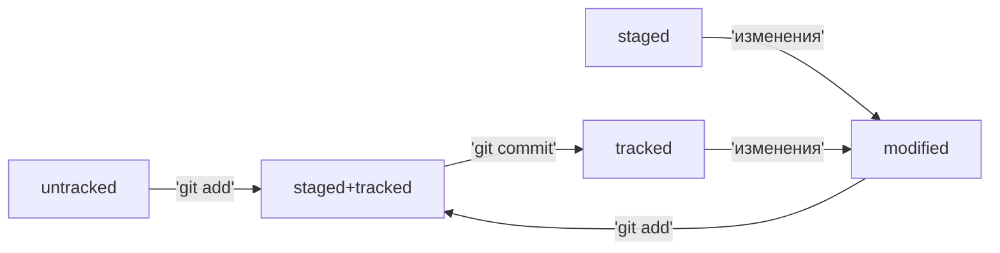
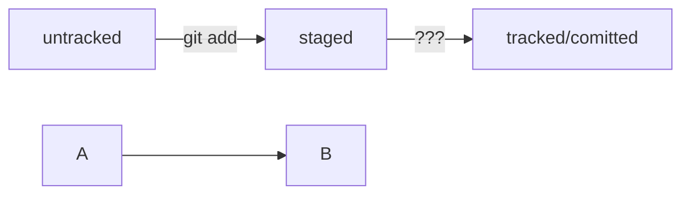

# Шпаргалка markdown

## Выделение текста

Вы можете выделять текст в markdown с помощью символов `_` или `*`. Например:

Пример _курсива_ и **жирного** текста.

## Заголовки

Заголовки можно создавать с помощью символа `#`. Чем больше `#`, тем меньше заголовок. Например:

# Заголовок первого уровня
## Заголовок второго уровня
### Заголовок третьего уровня

## Выделение кода

Чтобы выделить текст как код, поместите его в тройные кавычки `````. 

```
mkdir my_project
cd my_project
git init
```
Это лишь некоторые функции markdown.

HEAD -- это голова.
Коммит -- это всему голова.
Статусы файлов:
<тут пустая строка!>


<и тут пустая строка!>



# Ветки в Git 

Чтобы создать ветку, необходимо выполнить команду `git branch %BRANCH_NAME%`.

Для перехода в ветку есть команда `git checkout %BRANCH_NAME%`.
